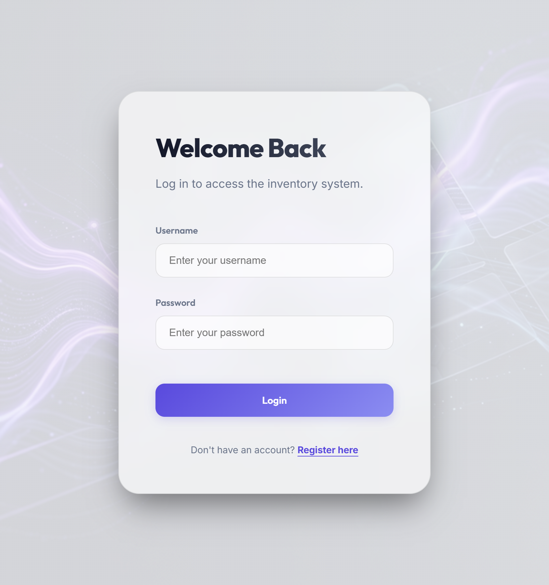
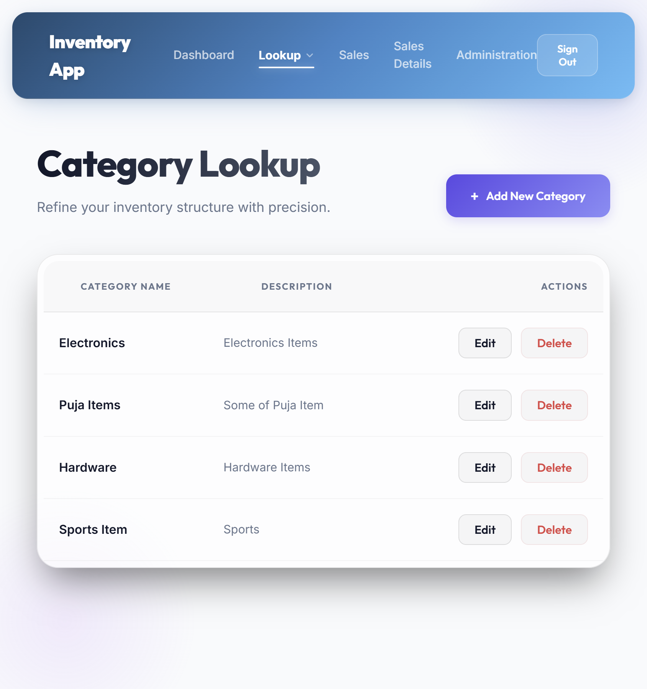
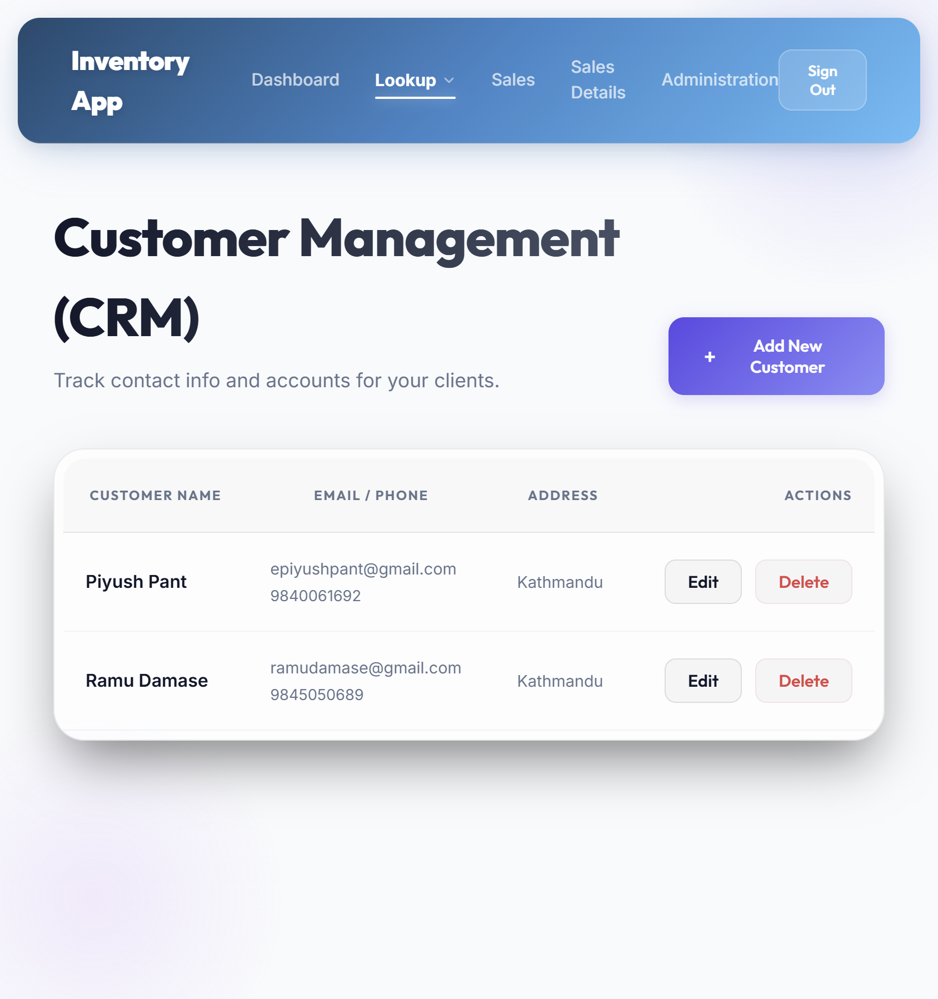
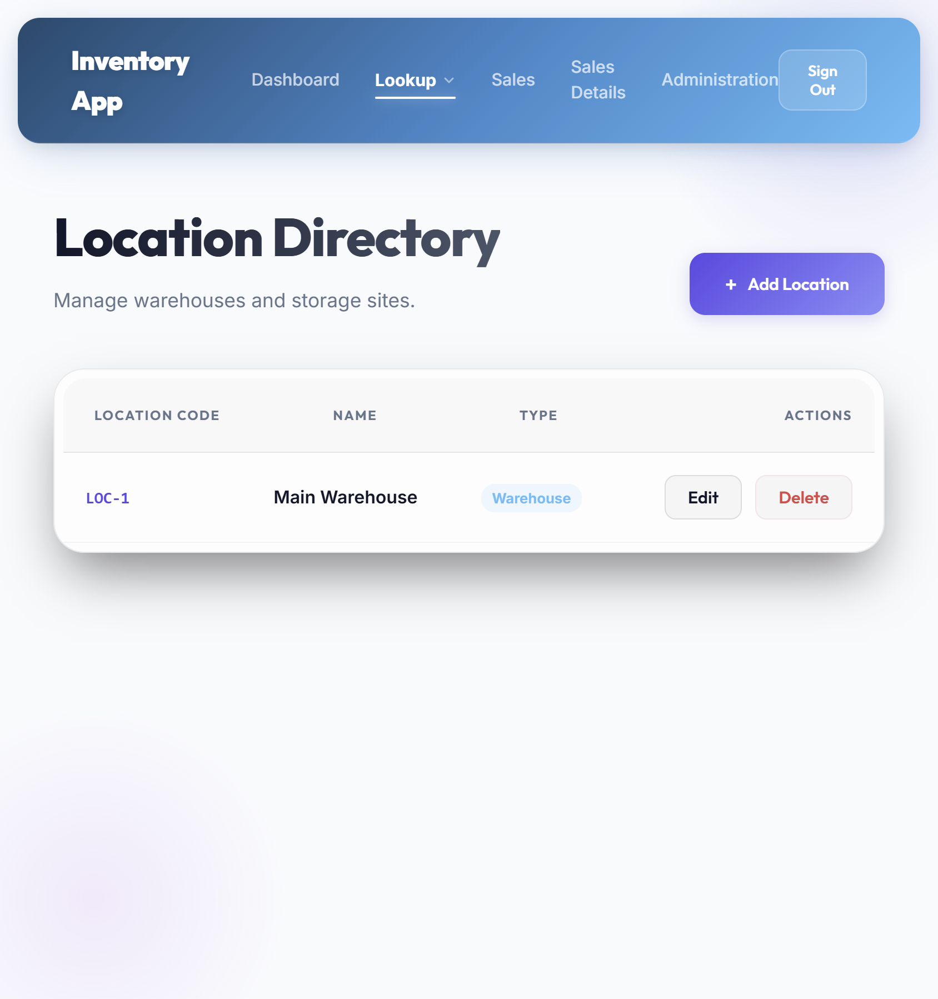
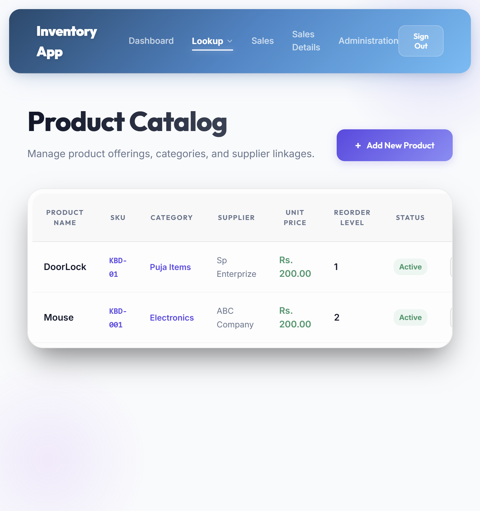
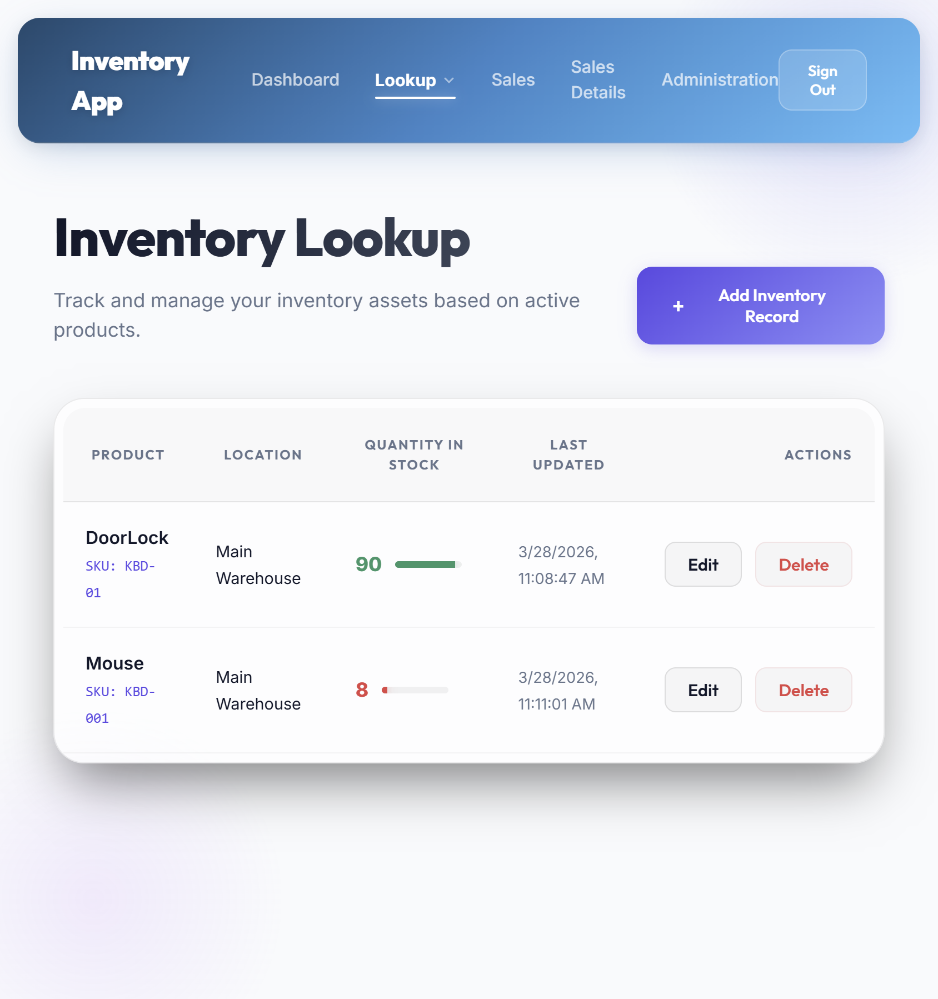
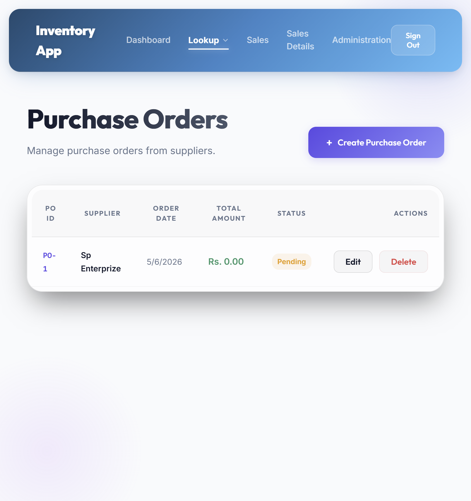
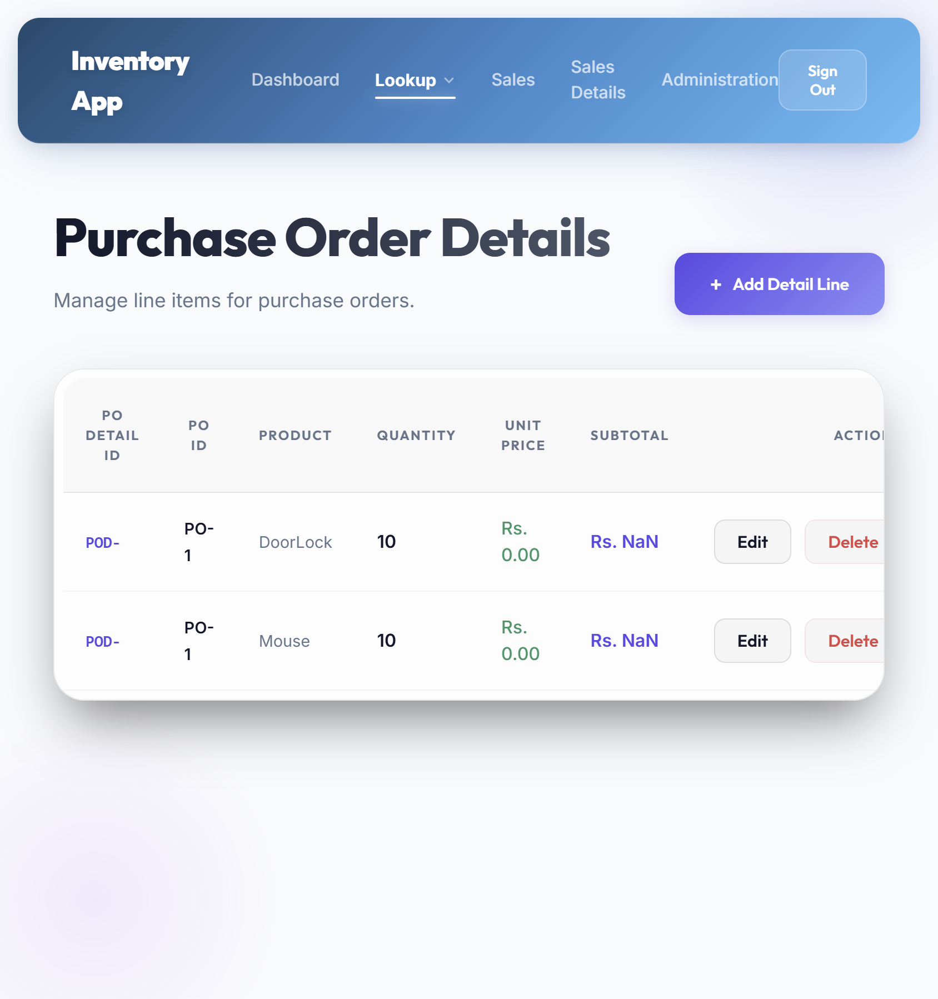
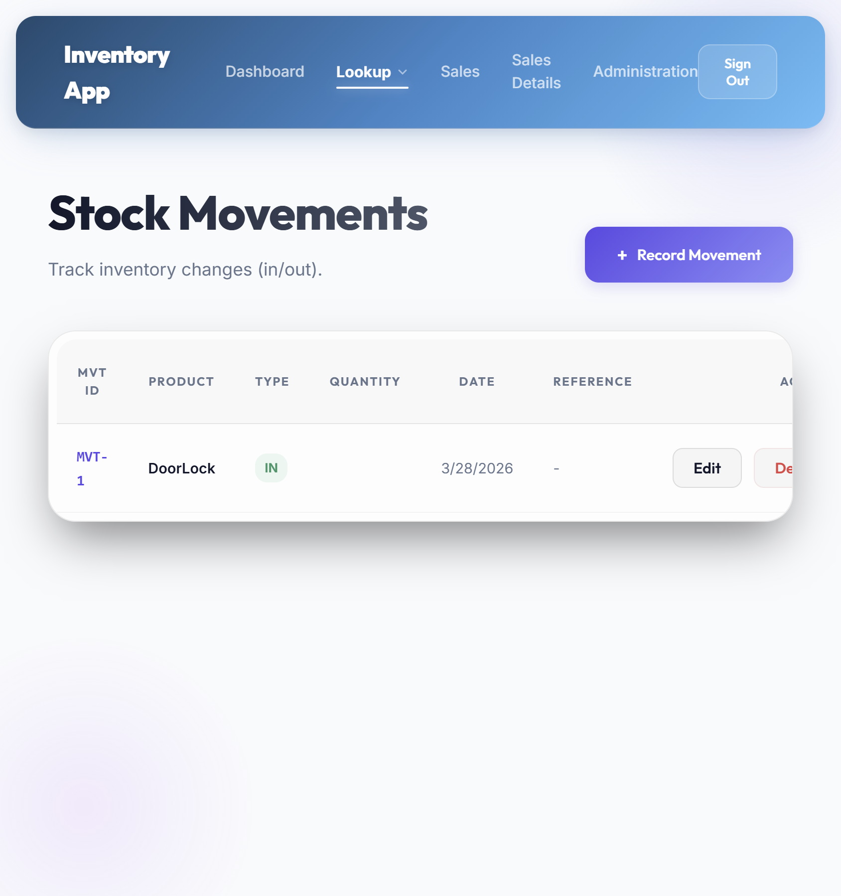
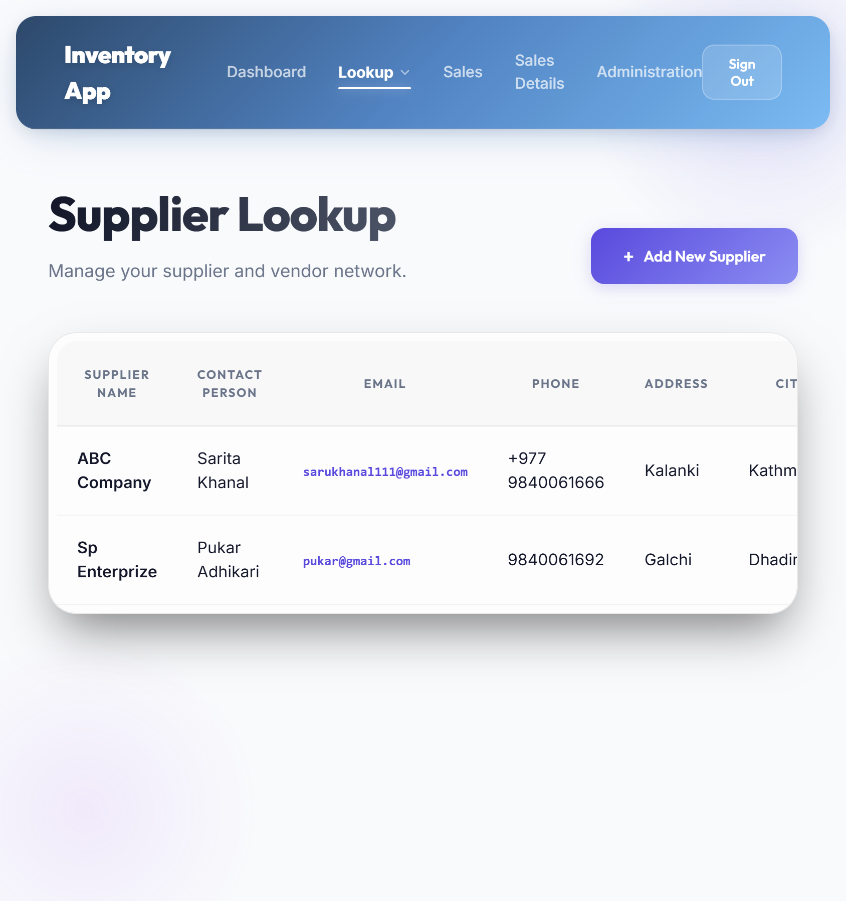

# Authentication Feature Documentation

## Overview
This document summarizes the authentication forms in the Inventory app based on the current UI.

## Login Form
- **Page title:** Welcome Back
- **Description:** Log in to access the inventory system.
- **Fields:**
  - Username
  - Password
- **Button:** Login
- **Footer:** "Don't have an account? Register here"
- **Behavior:**
  - Uses username/password authentication
  - Redirects to `/home` after successful login
  - Provides a link to the registration page

## Register Form
- **Page title:** Register New User
- **Description:** Create your account to access the inventory system.
- **Fields:**
  - Name
  - Username
  - Email
  - Password
- **Button:** Register
- **Footer:** "Already have an account? Login here"
- **Behavior:**
  - Creates a new account with name, username, email, and password
  - Sends registration data to the backend API
  - Redirects to login page after successful registration

## Notes
- The login flow is intentionally simple: username and password only.
- The registration flow collects standard user profile information.
- The UI is designed to be clean, modern, and user-friendly.

## Screenshots
Below are the saved frontend screenshot files.

### Authentication Forms
- Login form: `./screenshots/login.png`
- Register form: `./screenshots/register.png`

### Lookup Form Screenshots
The following lookup pages were captured from the running frontend:

- `Categories` (/categories) — `./screenshots/categories.png`
- `Customers` (/customers) — `./screenshots/customers.png`
- `Locations` (/locations) — `./screenshots/locations.png`
- `Products` (/products) — `./screenshots/products.png`
- `Inventories` (/inventories) — `./screenshots/inventories.png`
- `Purchase Orders` (/purchase-orders) — `./screenshots/purchase-orders.png`
- `Purchase Order Details` (/purchase-order-details) — `./screenshots/purchase-order-details.png`
- `Stock Movements` (/stock-movements) — `./screenshots/stock-movements.png`
- `Suppliers` (/suppliers) — `./screenshots/suppliers.png`

### Preview Images

Each screenshot shows the lookup form layout with the table and add button for that entity.
